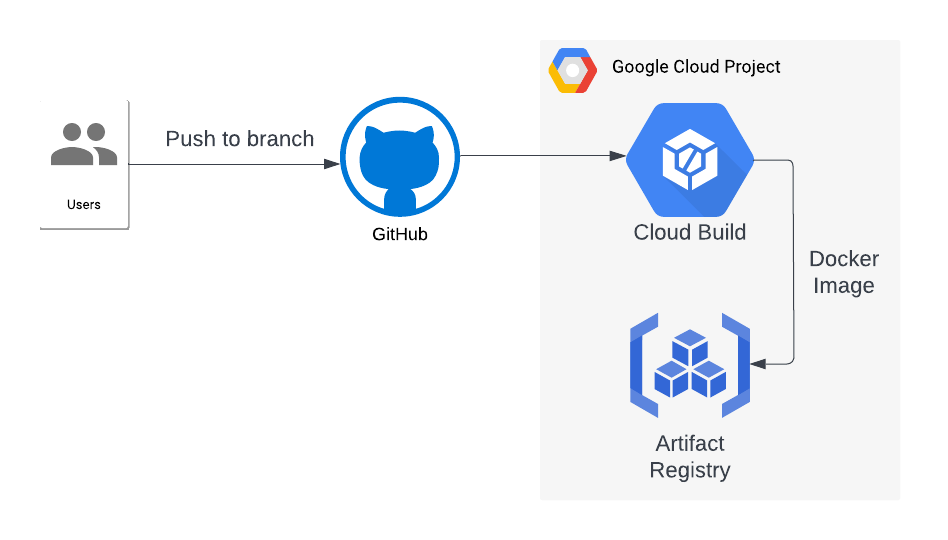
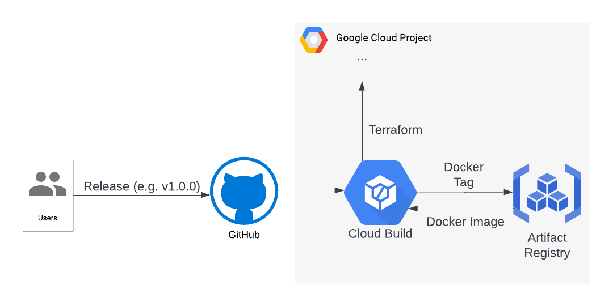

# 

> ### [TypeScript](https://www.typescriptlang.org/) codebase containing real world examples (CRUD, auth, advanced patterns, etc) that adheres to the [RealWorld](https://github.com/gothinkster/realworld) spec and API.

### [Demo](https://demo.realworld.io/)&nbsp;&nbsp;&nbsp;&nbsp;[RealWorld](https://github.com/gothinkster/realworld)

This codebase was created to demonstrate a fully fledged backend application built with **[TypeScript](https://www.typescriptlang.org/)** including CRUD operations, authentication, routing, pagination, and more.

We've gone to great lengths to adhere to the **[TypeScript](https://www.typescriptlang.org/)** community styleguides & best practices.

For more information on how to this works with other frontends/backends, head over to the [RealWorld](https://github.com/gothinkster/realworld) repo.

# How it works

This is an [Express.js](https://expressjs.com/) based web-application, written in [TypeScript](https://www.typescriptlang.org/), that implements the [RealWorld](https://realworld-docs.netlify.app/) API [endpoints](https://realworld-docs.netlify.app/docs/specs/backend-specs/endpoints).

It depends on [Firestore](https://cloud.google.com/firestore), a Serverless document database available on [Google Cloud](https://cloud.google.com/). Hence, this app can only be deployed on the Google Cloud platform.

## System Design

- [Cloud Load Balancing](https://cloud.google.com/load-balancing)
- [Cloud Run](https://cloud.google.com/run)
- [Firestore](https://cloud.google.com/firestore)

# Getting started

1. [Install `Node.js` and `npm`](https://docs.npmjs.com/downloading-and-installing-node-js-and-npm).
1. [Install `Docker`](https://docs.docker.com/get-docker/).
1. Run `npm start`.

## Testing

1. Run `npm test`.

# Deployment

## [Google Cloud](https://cloud.google.com/)

### Bootstrap

1. Create an [Organization](https://cloud.google.com/resource-manager/docs/creating-managing-organization) on Google Cloud.
1. Create a [Folder](https://cloud.google.com/resource-manager/docs/creating-managing-folders) on your Organization to create your projects in.
1. Create a [Billing Account](https://cloud.google.com/billing/docs/how-to/manage-billing-account#create_a_new_billing_account).
1. Install [terraform](https://developer.hashicorp.com/terraform/tutorials/aws-get-started/install-cli).
1. Install the [gcloud CLI](https://cloud.google.com/sdk/docs/install).
1. Run [`gcloud auth login`](https://cloud.google.com/sdk/gcloud/reference/auth/login).
1. Run [`gcloud auth application-default login`](https://cloud.google.com/sdk/gcloud/reference/auth/application-default/login).
1. Make sure you own a domain name and have access to it's DNS configuration. This will be necessary to [enable HTTPS](https://cloud.google.com/iap/docs/load-balancer-howto#update_dns).
1. `cd` into the [`deploy/google-cloud/terraform/bootstrap`](./deploy/google-cloud/terraform/bootstrap).
1. Comment out the entire contents of the [`backend.tf`](https://developer.hashicorp.com/terraform/language/settings/backends/gcs) file.
1. Create a [`terraform.tfvars`](https://developer.hashicorp.com/terraform/language/values/variables#variable-definitions-tfvars-files) file and add your variables' values.
1. Run `terraform init`.
1. Run `terraform apply -target=module.bootstrap_project`.
1. Uncomment the `backend.tf` file's contents and update the `bucket` argument to the value of the `tfstate_bucket` output.
1. Run `terraform init` and type `yes`.
1. [Manually connect the Github repositories via the console in CloudBuild](https://cloud.google.com/build/docs/automating-builds/github/connect-repo-github). Do not create a Trigger, just click `DONE` once the repository is connected.
1. Run `terraform apply`.

### Build

1. A [Cloud Build](https://cloud.google.com/build) shoud run to build and push a container image to [Artifact Registry](https://cloud.google.com/artifact-registry) everytime you push a commit to the branch corresponding to the value you set for the `github_repo_branch` variable.
1. If you set the value of the `deploy_on_push_to_branch` variable to `true` it will also deploy the system. This is useful for development environments (for example, deploying on every push to the `main` branch).

### Deploy

1. [Create a Release](https://docs.github.com/en/repositories/releasing-projects-on-github/managing-releases-in-a-repository#creating-a-release) on Github and tag the commit with a value matching the regex you used as the value of the `github_repo_commit_tag` variable.
1. After the system is deployed, [set up HTTPS for the created Load Balancers](https://cloud.google.com/iap/docs/load-balancer-howto#update_dns).

